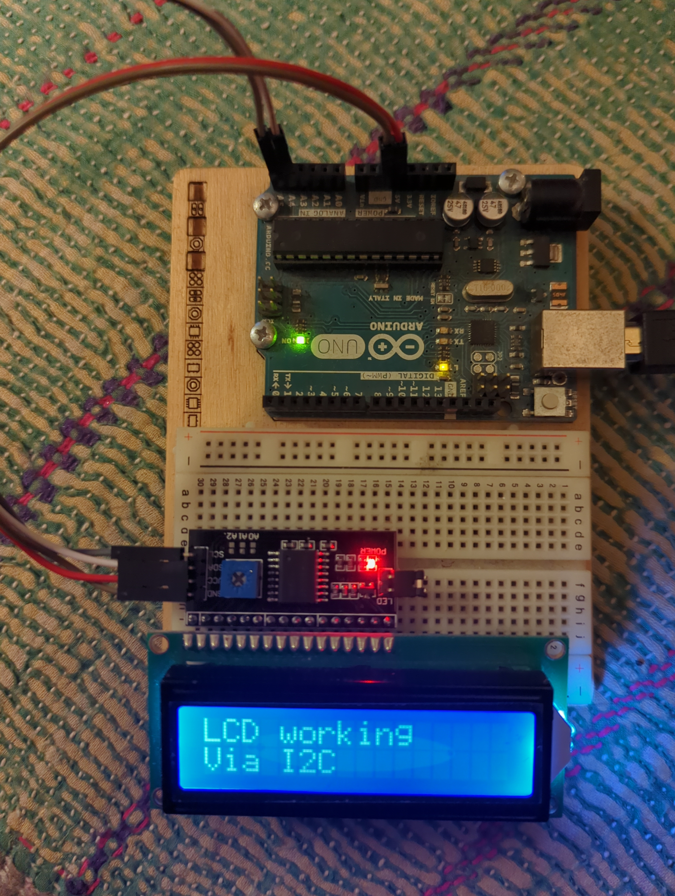
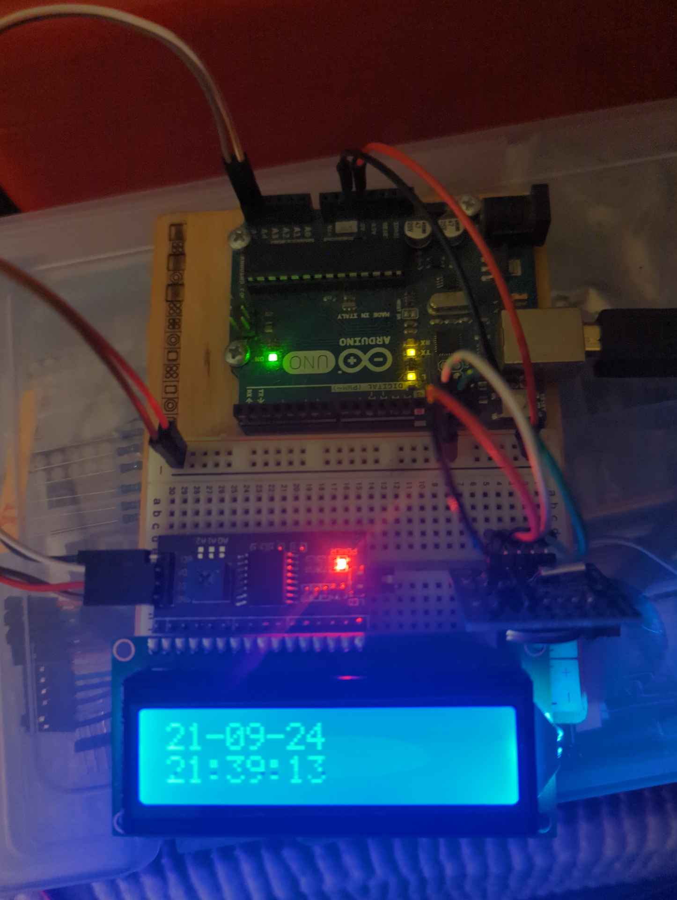

# lock-box

Building an arduino based time locked box.

This is my first "proper" Arduino project so I'm going to write up the process as I go.

The idea is a simply box that locks itself and then unlocks at a user specified time.

I've made some designs for a nice little box I already have.

DESIGNS

**Part List**

Arduino Nano - Brains
TP4056 - Battery Charging board
18650 Cells - Battery
Push pull mini solenoid - Lock
DS1307 I2C - Clock module
KY-040 Rotary Encoder - User Interface
LCM1602C - LCD Display
PCF8574T I2C Interface Board - nicer LCD intergration
All sort of other electrical gubbinz, CHANGE THIS UPON COMPLETION

I have sent off for the parts I dont already have, while I wait for those to arrive I'm going to build a prototype using what I already have:

A servo for the lock, LCD display + interface, Arduino Uno, DS1307, and buttons for interface.

RTC module sketch

LCD module sketch

RTC + LCD combined sketch

